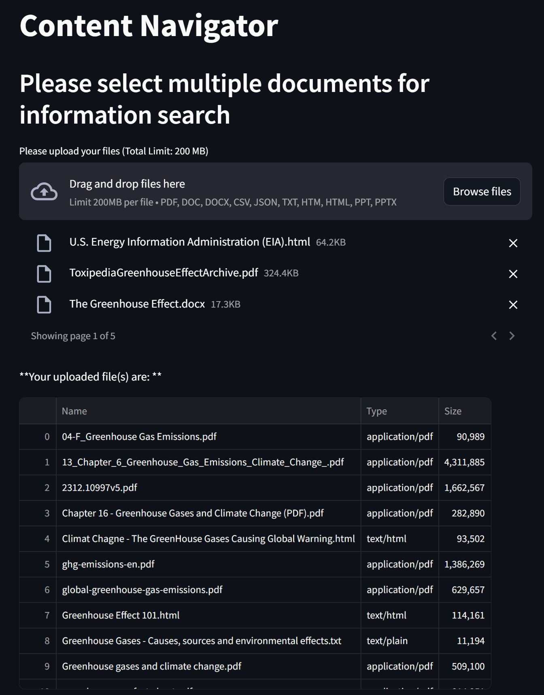
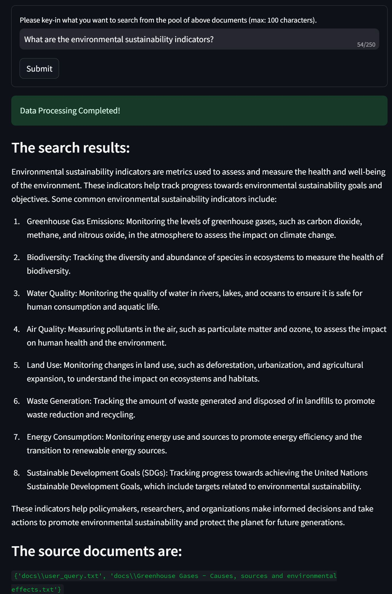

# Content Navigator

The Content Navigator empowers users to swiftly search for specific information across multiple uploaded documents in various formats. It's designed with a user-friendly interface and powerful search capabilities, making it a breeze to find relevant data in large sets of documents.

## Features

- **Multi-Format Support**: Upload and search across documents in various formats such as 'pdf', 'doc', 'docx', 'csv', 'json', 'txt', 'htm', 'html', 'ppt', and 'pptx'.
- **Flexible Search Options**: Specify the exact information you want to search for in each document.
- **Traceability**: View search results along with a trace of the relevant documents.
- **Scalability**: Handle large content by integrating with external vector databases using PineCone API.

Please note that by default, the app tries to use in-memory embedding for all document content. However, in case of extensive content combining all uploaded documents, the app conveniently uses the PineCone Vector Database.

## Demo

We have split the UI into two pieces to accommodate details in snapshots.

1. Multiple documents uploaded

   

2. Search query input and app output

   

### Installation

1. Clone the repository:

   ```bash
   git clone https://github.com/your-username/document-searcher.git
   ```

2. Navigate to the project directory
    ```
    cd document-searcher
    ```

3. Install Poetry using pip (if not already installed):

   ```bash
   pip install poetry
   ```

4. Activate the virtual environment using Poetry:
   ```bash
   pip shell
   ```

5. Install the project dependencies using Poetry: 
   ```bash
   poetry install
   ```


### Configuration

Create a `.env` file in the root directory of the project: 

1. Add your own OpenAI API key as:
   ```bash
   OPENAI_API_KEY = 'your-key-here'
   ```

2. In order to handle large document content, the app will use `PineCone` vector database. Please set up your PineCone API key:

   ```bash
   PINECONE_API_KEY = 'your_pinecone_api_key'
   ```

### Usage

1. After installing the dependencies, you can run the Streamlit app in the root directory by executing the following command:

   ```bash
   streamlit run app.py
   ```

2. Please follow the prompts and upload your documents in the permitted formats. 

3. Specify the information you want to search for.

4. The app will search the requested information, display the results and the trace of relevant documents.

### License

This project is licensed under the MIT License - see the [LICENSE](LICENSE) file for details.